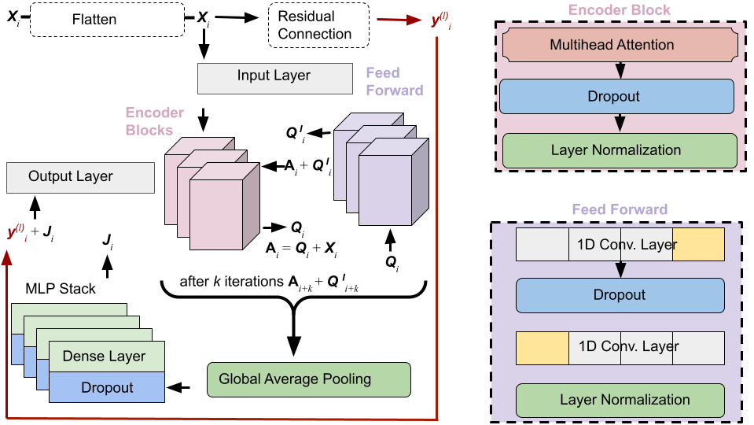
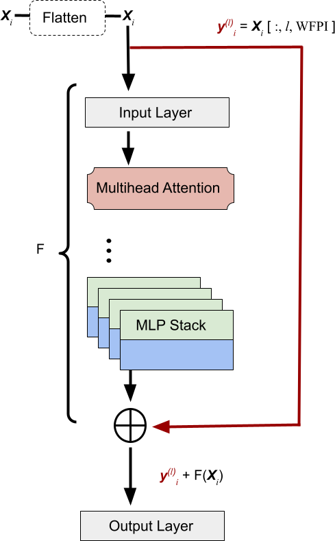
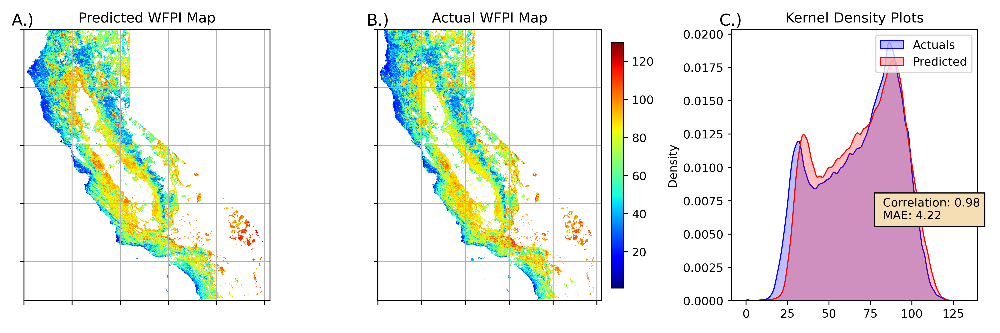

# Forecast of Wildfire Potential Across California, USA Using a Transformer

## Abstract

Wildfires are a significant challenge in the United States, further exacerbated by climate change. In California alone, wildfires cause billions of dollars in damages and claim lives each year. Accurately predicting fire danger conditions allows for better preparation and awareness before wildfires start.

Transformers, a class of deep learning models, are designed to identify patterns in sequential datasets. In recent years, transformers have demonstrated impressive performance in natural language processing and other signal recognition applications. This analysis explores the use of a transformer with a residual connection to forecast fire danger potential across California.

The study uses Wildland Fire Potential Index (WFPI) maps collected from the US Geological Survey (USGS) database between January 1, 2020, and December 31, 2023. Meteorological inputs, the Normalized Difference Vegetation Index (NDVI), and outputs from Scott and Burgman fire behavior fuel models were used as inputs. Results show that the transformer effectively emulates US Forest Service-modeled WFPI maps for four-week forecasts over July 2023, achieving correlations between **0.85–0.98**.

---

## Data

The following datasets were utilized in this analysis:

- **Meteorological Inputs**: Sourced from [Daymet](https://daymet.ornl.gov/getdata), maintained by Oak Ridge National Laboratory, at a resolution of 1km x 1km.
- **Normalized Difference Vegetation Index (NDVI)**: Calculated from Moderate Resolution Imaging Spectroradiometer (MODIS) satellite imagery via the [MODIS APPEARS API](https://appeears.earthdatacloud.nasa.gov/api/).
- **Wildland Fire Potential Index (WFPI)**: Pulled directly from the [USGS USFS Database](https://www.usgs.gov/fire-danger-forecast/data).

All maps were subsetted using a GeoJSON file of California.

---

## Model

### Transformer Architecture

#### Full Transformer Schematic

#### Residual Connection
A zoomed-in view of the residual connection in the transformer architecture.  

---

## Results

The transformer model demonstrated strong performance for forecasting fire danger in California. Below is an example of correlation results for forecasts made on **July 22, 2023**.

### Key Metrics
- **Correlation Range**: 0.85–0.98
- **Forecast period**: Four weeks (July 2023)
- **emulates forecasts in 6 minutes and 20 seconds**

---

## Publication

This work was presented at the **2nd International Workshop on Big Data Analytics with Artificial Intelligence for Climate Change** as part of **IEEE Big Data 2024**.

---

## Acknowledgment

This research used resources of the National Energy Research Scientific Computing Center (NERSC), a Department of Energy Office of Science User Facility for project m2467 of 2024. This manuscript has been authored in part by UT-Battelle, LLC, under contract DE-AC05-00OR22725 with the US Department of Energy (DOE). The publisher acknowledges the US government license to provide public access under the [DOE Public Access Plan](http://energy.gov/downloads/doe-public-access-plan}).

---

## How to Cite

If you use this work, please cite:
> [Author(s)]. *Forecast of Wildfire Potential Across California USA Using a Transformer*. Presented at IEEE Big Data 2024, 2nd International Workshop on Big Data Analytics with Artificial Intelligence for Climate Change.

